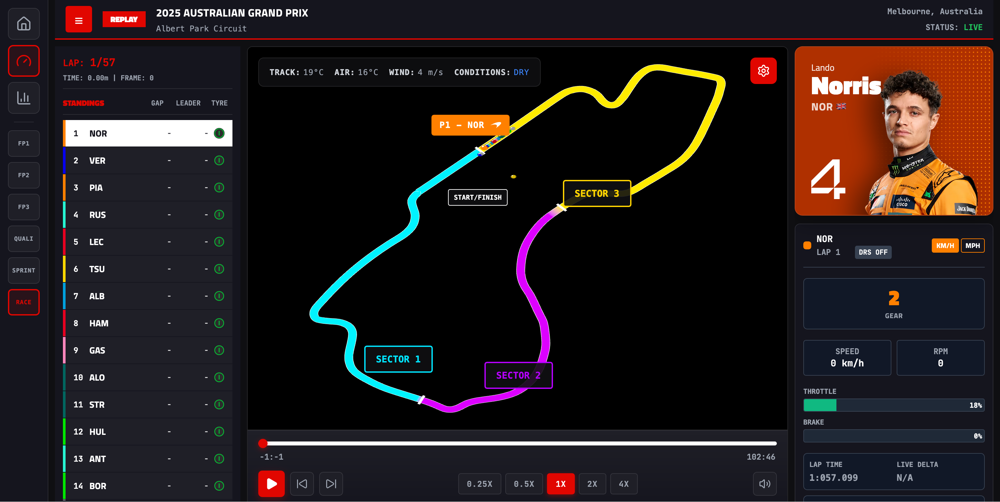
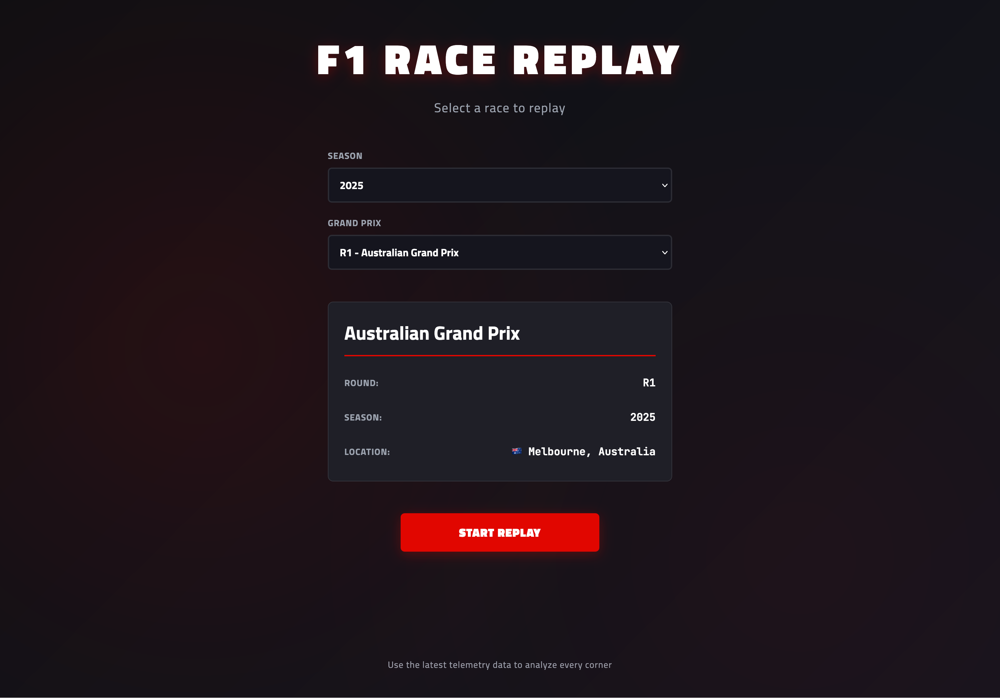
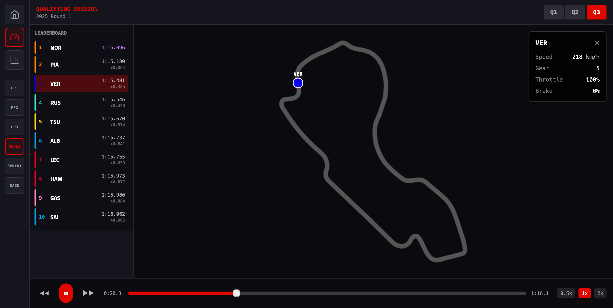
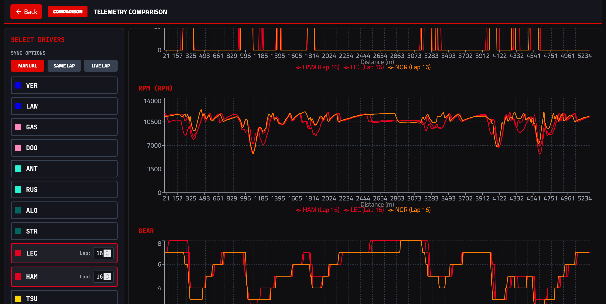
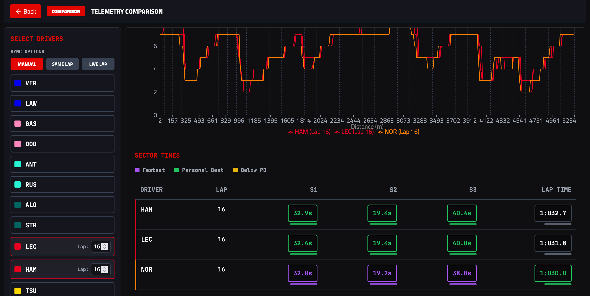
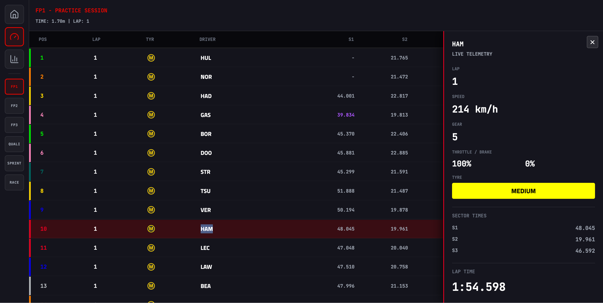

# F1 Race Replay

[](https://opensource.org/licenses/MIT)
[](https://github.com/jamesadams90/f1-race-replay)

A full-stack web application for exploring Formula 1 race telemetry with interactive 3D race visualization, live leaderboards, and detailed telemetry analysis. Powered by [FastF1](https://docs.fastf1.dev/) for real race data.



## 🚀 Features

- **3D Race Replay** – Interactive track visualization with real-time driver positions using Three.js
- **Live Leaderboard** – Current standings with tyre compounds, gaps, and multi-tier positioning
- **Driver Telemetry** – Speed, throttle, brake, gear, and DRS status analysis with charts
- **Multi-session Support** – Race, Sprint, Qualifying, and Sprint Qualifying replays
- **Real-time Streaming** – WebSocket-based frame delivery for smooth playback
- **Session Comparison** – Side-by-side driver/lap comparison tools (in development)
- **Smart Caching** – Fast reruns with automatic FastF1 and computed telemetry caching
- **Image Preloading** – Driver images, team logos, and tyre icons with fallback support

### Screenshots

<details>
<summary>View more screenshots</summary>

**Race Selection**


**Qualifying Session**


**Telemetry Comparison**


**Sector Times Analysis**


**Practice Session**


</details>

## 🛠 Tech Stack

**Backend:**
- FastAPI (Python) with WebSocket support
- FastF1 for F1 telemetry data
- Multiprocessing for parallel frame generation (25 FPS)
- Pandas & NumPy for data processing

**Frontend:**
- React 18 with TypeScript
- Three.js for 3D visualization (via react-three-fiber)
- Zustand for state management
- Tailwind CSS for styling
- Vite for fast build tooling

**Data Processing:**
- Python utilities for telemetry extraction
- Pickle-based caching system
- Track geometry calculation from telemetry

## 📦 Quick Start

### Prerequisites

- **Python 3.10+** – [Download](https://www.python.org/)
- **Node.js 18+** (LTS recommended) – [Download](https://nodejs.org/)

### Installation (One Command)

**macOS/Linux:**
```bash
bash scripts/install.sh
```

**Windows:**
```bash
scripts\install.bat
```

This will automatically:
- ✅ Verify Python and Node.js are installed
- ✅ Create Python virtual environment
- ✅ Install all backend dependencies
- ✅ Install all frontend dependencies

### Running the Application

```bash
npm start
```

Or equivalently:
```bash
npm run dev
```

Both commands will:
- 🗑️ Clear cached telemetry data (fresh API calls)
- 🔌 Free up ports 8000, 5173, and 3000
- 🚀 Start backend (FastAPI) on http://localhost:8000
- 🚀 Start frontend (React) on http://localhost:5173
- 🌐 Automatically open browser to http://localhost:5173

### Running Components Separately

**Backend only:**
```bash
cd backend
source venv/bin/activate  # macOS/Linux
# or: call venv\Scripts\activate.bat  # Windows
python main.py
```
Available at http://localhost:8000

**Frontend only:**
```bash
cd frontend
npm run dev
```
Available at http://localhost:5173

### Development Commands

**Build frontend for production:**
```bash
cd frontend && npm run build
```

**Run without opening browser:**
```bash
npm run dev -- --no-open
```

**Manual cache clearing (if needed):**
- Computed telemetry cache: `rm -rf data/` (or `rmdir /s data` on Windows)
- FastF1 API cache: `rm -rf .fastf1-cache/` (or `rmdir /s .fastf1-cache` on Windows)

## 📚 Documentation

- **[docs/ROADMAP.md](./docs/ROADMAP.md)** – Planned features and development roadmap
- **[docs/](./docs/)** – Architecture guides, troubleshooting, and additional documentation

## 🏗 Architecture

```
┌─────────────────────────────────────────────────┐
│ Frontend (React/TypeScript/Three.js)            │
│ - 3D race visualization                         │
│ - Interactive leaderboard                       │
│ - Playback controls & telemetry charts          │
│ - WebSocket connection to backend               │
└──────────────────┬──────────────────────────────┘
                   │ WebSocket/HTTP
┌──────────────────▼──────────────────────────────┐
│ Backend (FastAPI)                               │
│ - Session management                            │
│ - Frame streaming via WebSocket                 │
│ - Track geometry calculation                    │
│ - REST API endpoints                            │
└──────────────────┬──────────────────────────────┘
                   │
┌──────────────────▼──────────────────────────────┐
│ Data Processing (Python/shared/)                │
│ - FastF1 telemetry loading                      │
│ - Multiprocessing frame generation (25 FPS)    │
│ - Caching system (.fastf1-cache/, data/)       │
└─────────────────────────────────────────────────┘
```

## 🐛 Known Issues

- Leaderboard may be inaccurate in first few corners due to telemetry precision
- Pit stops can temporarily affect position calculations
- Final lap positions sometimes affected by final telemetry point locations

See [Issues](https://github.com/jamesadams90/f1-race-replay/issues) for the full list and to report new ones.

## 🤝 Contributing

We welcome contributions! Here's how to get started:

1. **Fork the repository** and create your feature branch (`git checkout -b feature/amazing-feature`)
2. **Follow the development guidelines** in CLAUDE.md
3. **Test your changes** thoroughly
4. **Commit with clear messages** describing your changes
5. **Push to your branch** and open a Pull Request

### Development Workflow

- **Code style:** Follow existing patterns in the codebase
- **Testing:** Run tests before submitting PRs (if applicable)
- **Documentation:** Update docs for new features
- **No Claude attribution:** Keep commit messages focused on changes only

See [docs/ROADMAP.md](./docs/ROADMAP.md) for planned features and areas where help is needed.

## 📊 Performance Notes

- **First run:** Telemetry computation can take several minutes (depends on session length)
- **Subsequent runs:** Loads from cache in seconds
- **Multiprocessing:** Uses all available CPU cores for data processing

## 📋 Project Status

**Current Phase:** Beta (Phase 7 - Comprehensive Testing & Cleanup)

**Recent Updates:**
- ✅ Position smoothing for accurate driver tracking
- ✅ Playback animation loop with frame advancement
- ✅ Driver card display with country flags
- ✅ Image preloading and optimization
- ✅ Qualifying session replay with Q1/Q2/Q3 segments
- ✅ Practice session timing and telemetry views
- ✅ Telemetry comparison with sector times analysis
- 🚧 Session comparison tools (in development)
- 📋 GUI menu system (planned)

## 📄 License

This project is licensed under the MIT License – see [LICENSE](./LICENSE) file for details.

## ⚖️ Disclaimer

Formula 1 and related trademarks are property of their respective owners. This project uses publicly available data from FastF1 for educational and non-commercial purposes only. No official endorsement is implied.

## 🙋 Support

- **Questions?** Check out the [documentation](./docs/) and [roadmap](./docs/ROADMAP.md)
- **Found a bug?** [Open an issue](https://github.com/jamesadams90/f1-race-replay/issues)
- **Want to discuss?** Discussions welcome in the issues section

---

**Made with ❤️ by F1 fans, for F1 fans**
