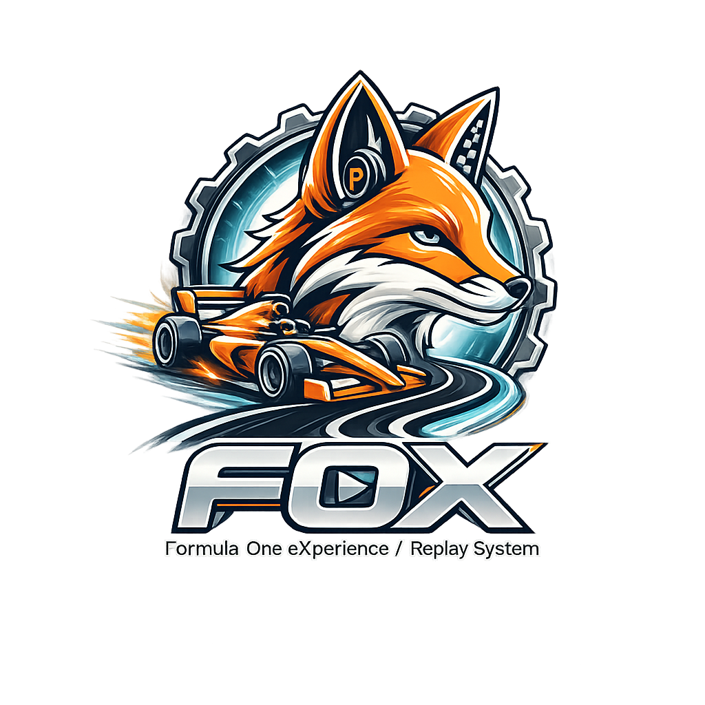
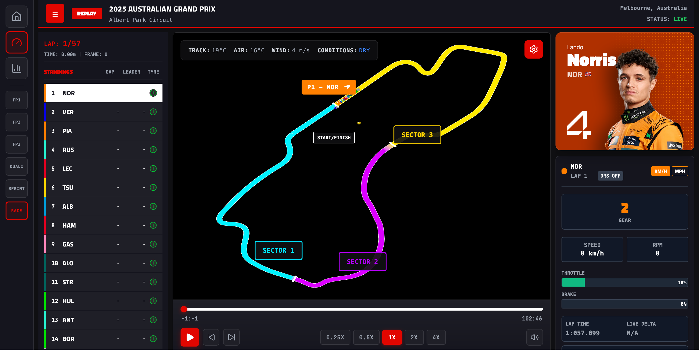
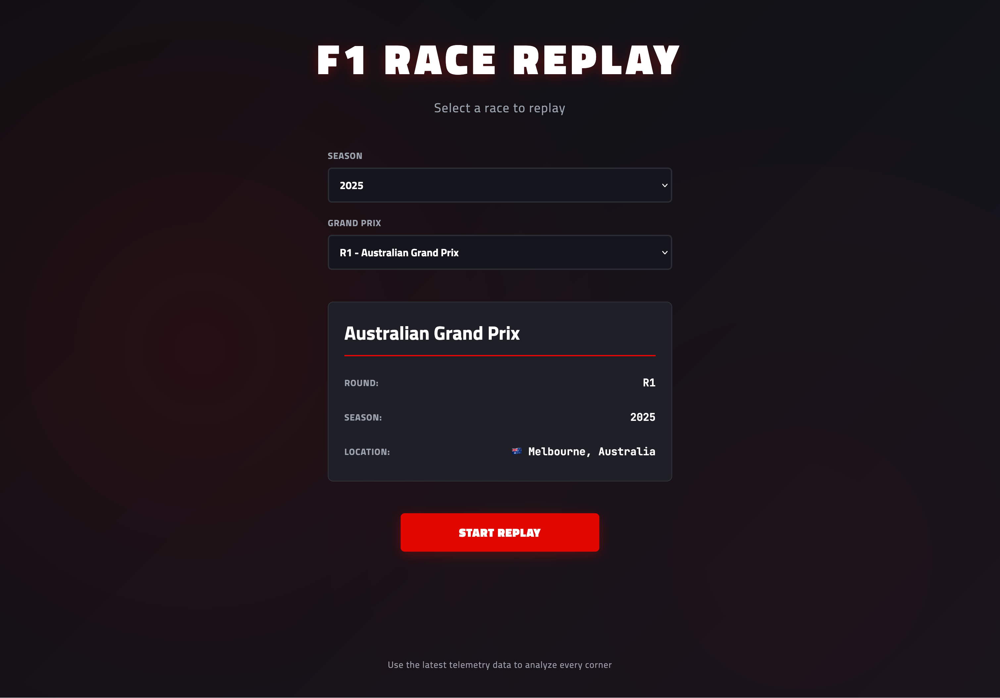
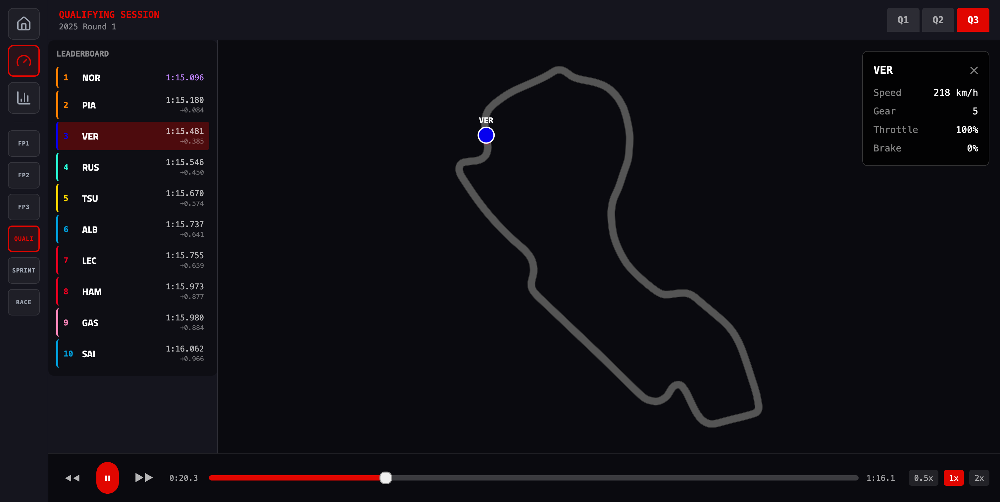
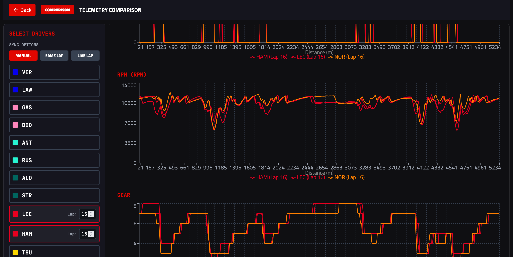
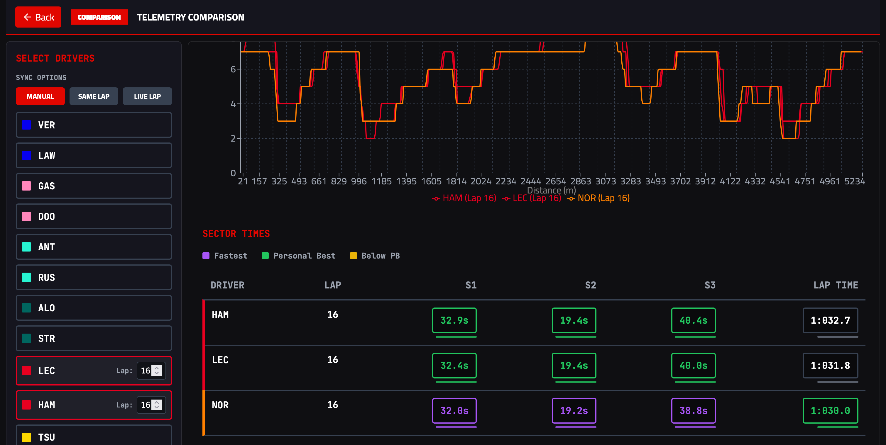
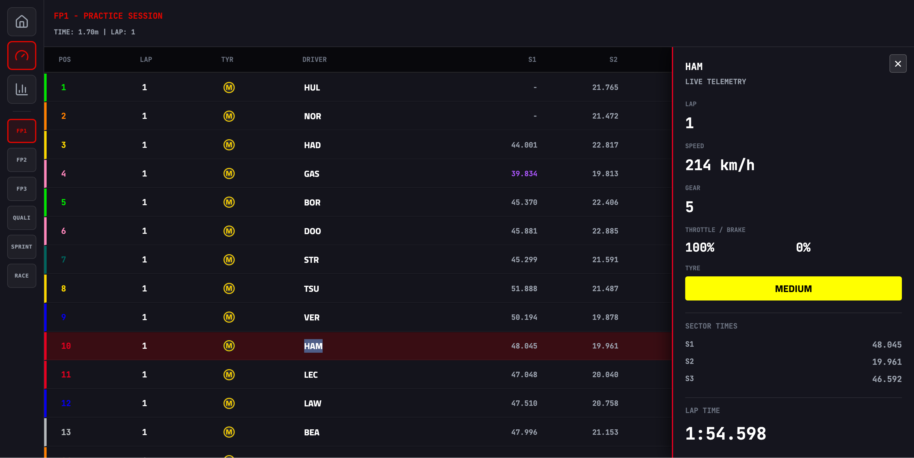

<p align="center">
  
</p>

<h1 align="center">FOX Replay System</h1>
<h3 align="center">Formula One eXperience // Replay System</h3>

<p align="center">
  <a href="https://opensource.org/licenses/MIT"></a>
  <a href="#"></a>
</p>

A full-stack web application for exploring Formula 1 race telemetry with interactive 3D race visualization, live leaderboards, and detailed telemetry analysis. Powered by [FastF1](https://docs.fastf1.dev/) for real race data.



## Features

- **3D Race Replay** -- Interactive track visualization with real-time driver positions using Three.js
- **Live Leaderboard** -- Current standings with tyre compounds, gaps, and multi-tier positioning
- **Driver Telemetry** -- Speed, throttle, brake, gear, and DRS status analysis with charts
- **Multi-session Support** -- Race, Sprint, Qualifying, and Sprint Qualifying replays
- **Real-time Streaming** -- WebSocket-based msgpack frame delivery for smooth playback
- **Session Comparison** -- Side-by-side driver/lap comparison tools (in development)
- **Smart Caching** -- Fast reruns with automatic FastF1 and computed telemetry caching
- **Image Preloading** -- Driver images, team logos, and tyre icons with fallback support

### Screenshots

<details>
<summary>View more screenshots</summary>

**Race Selection**


**Qualifying Session**


**Telemetry Comparison**


**Sector Times Analysis**


**Practice Session**


</details>

## Tech Stack

**Go Backend (port 8000):**
- Go 1.22+ with Chi router and Gorilla WebSocket
- Session management, frame streaming via WebSocket (msgpack binary)
- Multi-tier position smoothing with hysteresis
- Gap computation, retirement detection
- Zap structured logging

**Python Bridge (port 8001):**
- FastF1 for F1 telemetry data extraction
- Pandas & NumPy for data processing
- msgpack serialization to Go backend
- Runs as a subprocess managed by the Go backend

**Frontend (port 5173):**
- React 18 with TypeScript
- Three.js for 3D track visualization
- Zustand for state management
- msgpackr for binary WebSocket frame decoding
- Tailwind CSS for styling
- Vite dev server

## Quick Start

### Prerequisites

- **Go 1.22+** -- [Download](https://go.dev/dl/)
- **Python 3.10+** -- [Download](https://www.python.org/)
- **Node.js 18+** (LTS recommended) -- [Download](https://nodejs.org/)

### Installation

**1. Clone the repository:**
```bash
git clone https://github.com/jamesadams90/f1-race-replay.git
cd f1-race-replay
```

**2. Install Python dependencies:**
```bash
cd backend
python -m venv venv

# macOS/Linux:
source venv/bin/activate

# Windows:
venv\Scripts\activate

pip install -r requirements.txt
cd ..
```

**3. Install frontend dependencies:**
```bash
cd frontend
npm install
cd ..
```

**4. Verify Go builds:**
```bash
cd go-backend
go build -o f1-replay-go .
cd ..
```

Or use the install script:

**macOS/Linux:**
```bash
bash scripts/install.sh
```

**Windows:**
```bash
scripts\install.bat
```

### Running the Application

```bash
npm start
```

Or equivalently:
```bash
npm run dev
```

This will:
1. Build the Go backend binary
2. Start the Go backend on http://localhost:8000
3. Go backend spawns the Python FastF1 bridge internally (port 8001)
4. Start the React frontend on http://localhost:5173
5. Open browser to http://localhost:5173

### Running Components Separately

**Go backend only:**
```bash
npm run dev:go-only
```

**Frontend only (requires backend already running):**
```bash
cd frontend
npm run dev
```

### Development Commands

| Command | Description |
|---------|-------------|
| `npm run dev` | Start all services (Go + Python bridge + frontend) |
| `npm run dev:go-only` | Start Go backend + Python bridge only |
| `npm run dev:no-go` | Start frontend only (legacy Python mode) |
| `npm run dev:verbose` | Start all services with verbose logging |
| `npm run build:go` | Build Go backend binary |
| `npm run build:frontend` | Build frontend for production |
| `npm run build` | Build everything |
| `npm run test:go` | Run Go backend tests |
| `npm run lint:go` | Run Go vet and fmt |
| `npm run clean` | Remove build artifacts and cache |
| `npm run rebuild` | Clean, rebuild Go, and start |

### Cache Management

FOX Replay caches telemetry data for fast reruns:

- **FastF1 API cache:** `.fastf1-cache/` -- raw API responses from FastF1
- **Computed telemetry:** `computed_data/` -- pre-processed frame data

To clear caches:
```bash
# macOS/Linux:
rm -rf computed_data/ .fastf1-cache/

# Windows:
rmdir /s /q computed_data .fastf1-cache
```

## Architecture

```
┌─────────────────────────────────────────────────┐
│ Frontend (React/TypeScript/Three.js)            │
│ - 3D race visualization with Three.js           │
│ - Interactive leaderboard with gap times         │
│ - Playback controls & telemetry charts           │
│ - WebSocket (msgpack binary) frame decoding      │
│ - Zustand state management                       │
└──────────────────┬──────────────────────────────┘
                   │ WebSocket (msgpack) / HTTP (JSON)
┌──────────────────▼──────────────────────────────┐
│ Go Backend (Chi + Gorilla WebSocket)             │
│ - Session management & caching                   │
│ - Frame generation at 25 FPS                     │
│ - Position smoothing (4-tier + hysteresis)        │
│ - Gap computation & retirement detection          │
│ - WebSocket frame streaming (msgpack)             │
│ - REST API endpoints                              │
└──────────────────┬──────────────────────────────┘
                   │ Subprocess (stdin/stdout msgpack)
┌──────────────────▼──────────────────────────────┐
│ Python Bridge (FastF1)                           │
│ - FastF1 telemetry loading & extraction           │
│ - Raw data serialization via msgpack              │
│ - Managed as subprocess by Go backend             │
│ - Caching (.fastf1-cache/, computed_data/)        │
└─────────────────────────────────────────────────┘
```

### Data Flow

1. User selects a race session in the frontend
2. Frontend sends HTTP request to Go backend to create a session
3. Go backend spawns Python bridge to extract telemetry via FastF1
4. Python bridge sends raw telemetry data back via msgpack
5. Go backend generates frames (25 FPS), applies position smoothing, computes gaps
6. Frontend connects via WebSocket, receives binary msgpack frames
7. Frontend decodes frames and renders 3D track, leaderboard, and telemetry charts

## Known Issues

- Leaderboard may be inaccurate in first few corners due to telemetry precision
- Pit stops can temporarily affect position calculations
- Final lap positions sometimes affected by final telemetry point locations

See [Issues](https://github.com/jamesadams90/f1-race-replay/issues) for the full list and to report new ones.

## Contributing

Contributions welcome! Here's how to get started:

1. **Fork the repository** and create your feature branch (`git checkout -b feature/amazing-feature`)
2. **Test your changes** thoroughly
4. **Commit with clear messages** describing your changes
5. **Push to your branch** and open a Pull Request

### Development Workflow

- **Code style:** Follow existing patterns in the codebase
- **Testing:** Run `npm run test:go` before submitting PRs
- **Documentation:** Update docs for new features

See [docs/ROADMAP.md](./docs/ROADMAP.md) for planned features and areas where help is needed.

## Performance Notes

- **First run:** Telemetry extraction via FastF1 can take several minutes (depends on session length)
- **Subsequent runs:** Loads from cache in seconds
- **Frame generation:** Go backend generates and processes frames significantly faster than the original Python implementation

## Project Status

**Current Phase:** Beta

**Recent Updates:**
- Position smoothing with 4-tier hierarchy and hysteresis
- Go backend with WebSocket frame streaming (msgpack binary)
- Playback animation loop with frontend-driven frame advancement
- Driver card display with country flags
- Image preloading and optimization
- Qualifying session replay with Q1/Q2/Q3 segments
- Practice session timing and telemetry views
- Telemetry comparison with sector times analysis
- Session comparison tools (in development)

## Documentation

- **[docs/ROADMAP.md](./docs/ROADMAP.md)** -- Planned features and development roadmap
- **[docs/](./docs/)** -- Architecture guides, troubleshooting, and additional documentation

## License

This project is licensed under the MIT License -- see [LICENSE](./LICENSE) file for details.

## Acknowledgments

This project was inspired by [f1-race-replay](https://github.com/IAmTomShaw/f1-race-replay) by Tom Shaw. The original project provided the foundation and inspiration for FOX Replay System.

## Disclaimer

Formula 1 and related trademarks are property of their respective owners. This project uses publicly available data from FastF1 for educational and non-commercial purposes only. No official endorsement is implied.

## Support

- **Questions?** Check out the [documentation](./docs/) and [roadmap](./docs/ROADMAP.md)
- **Found a bug?** [Open an issue](https://github.com/jamesadams90/f1-race-replay/issues)
- **Want to discuss?** Discussions welcome in the issues section

---

<p align="center"><strong>FOX Replay System</strong> -- Made with care by F1 fans, for F1 fans</p>
